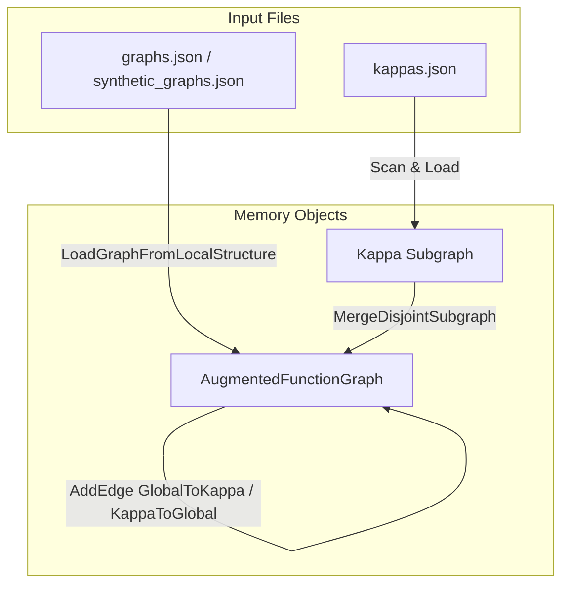

# Quick Documentation Overview: Augmented Function Graph Loading

This document outlines the core architecture and usage of the augmented function graph loader, which integrates mathematical basis graphs with h-function (kappa) structures for Graph Neural Network (GNN) message passing.

## Core Concepts

The main objective is to enrich a base mathematical function graph with mathematical h-functions (referred to as "Kappas"). By doing so, the GNN can reason about global properties alongside localized expressions.



### Key Components

1. **`LoadGraphFromLocalStructure`**: Loads a mathematical graph from local files (in JSON or GraphML format) and parses it into a unified NetworkX-compatible structure.
2. **`AugmentedFunctionGraph`**: A custom NetworkX `DiGraph` representation that provides:
   - Global node tracking (`HasGlobalNode`, `GetGlobalNode`, `CreateVirtualGlobalNode`).
   - Disjoint subgraph merging (`MergeDisjointSubgraph`) with automated suffix renaming (shifting IDs) to avoid identifier collisions.
3. **`LoadAugmentedFunctionGraph`**: The central orchestration pipeline that merges the base graph and the appropriate kappa subgraphs, connecting them bidirectionally to the global node with mathematical values mapped as edge weights.

## Usage Example

```python
from gnn.shared.utils.graph_utils import LoadAugmentedFunctionGraph

# Paths to the folders containing bases and kappas
graphs_folder = "datasets/graphs"
kappas_folder = "datasets/kappas"

# Load the combined augmented graph for ID "P1"
augmented_graph = LoadAugmentedFunctionGraph(
    graphId="P1",
    graphsFolder=graphs_folder,
    kappasFolder=kappas_folder
)

# The returned object is a standard NetworkX DiGraph subclass
print(f"Nodes: {len(augmented_graph.nodes)}")
print(f"Edges: {len(augmented_graph.edges)}")
```
